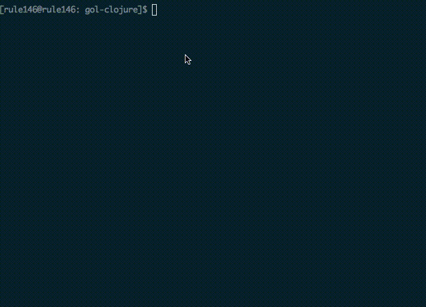

# Game of Life in Clojure

An implementation of the Game of Life in Clojure.

## Running

Clone this repo and cd into the `gol-clojure` directory:

```bash
[rule146@rule146: gol-clojure]$ ls
LICENSE      doc/         resources/   target/
README.md    project.clj  src/         test/
```

Do `lein run` and a random initial board will be output to the terminal:

```bash
[rule146@rule146: gol-clojure]$ lein run
ooo-o-oo-o---ooo--ooo--oo--o-o---oo---ooo-o-o-oooo
oooo----ooo-----o---oo-o--ooo-o-oo--oo-----oooooo-
---o-o-oo-oo--o-oo-oooo----o-ooo-ooo-o---o-o-oo--o
-oo-o-ooo--oo-oooooooo-oo---oo-----o-o-oo--o-oo-oo
-o-----oo-----o----oooo-----o-o---o-o----ooo--ooo-
o-oooo-o-o---ooo-oooo--o-----o--o-o----o-oooo---o-
-----ooooooooooo--oo---ooo-oo--o-oo----ooo----oo--
--o-----o-o---ooo-o-oooooo---ooo--oo-oo---o--o-oo-
---oo---o-oo----oooooo-o--o---oo-o-o--o-o---o-ooo-
o---oooo-ooo--oooo-oooo------ooo-oo--oo---oo----o-
o-o-o-o-o-o--ooo-o-o-o---o-ooo-o---o---oooo---o---
oooo----o---o--o-oo--oo-o---oo-ooo-o--o---oo-o-o--
-------o-oo--o---o-o-o---o----oo-----o---oo-oo-oo-
ooo-o-oo-oooo--ooo--o---oooo-o-o---oo-oo-oo-------
----oo--o--ooo--o-o--o--o-oo-o------ooooo-o-o-o-oo
-----o-ooo--o--o---ooo-o--o---ooo--o--o--ooo-o-o-o
oo--o-oo-oo---oo----o---o--o---oo-o-o-o-o--o-o-o--
---oooo--oo-----ooo-----oooo---o-oo--oo--o--oo--oo
o-oo--o-o--o--oooo-ooo--o--oo--o---o--oooo-oo--o--
-ooooo--oo-o-o-o-o-oo----oo---oooo----oooooo--ooo-
oooooo--ooo-o--o-oo-o--oo-o-o-o-----o-o--o---o-oo-
oo---o-ooo--oo--o--oo--ooo---o---o----oo-o---oooo-
-o----oo-o-oo-o-o-oooo-o---oo---o-o--ooooo--oooo--
------ooo-oooo-oo-ooooo-o-o-----o-o---oo--o-----oo
o----o-o-o--ooo-o--o-oo---oooooo-o--o-o-o-o-ooooo-
```

Hit return in the shell repeatedly and the board will get updated:

```bash
o------o-oo---oo---oooooo-oo-o--ooo--ooo----o----o
o----o-----o-o--o------oo-o---------oo-ooo--------
o----o------ooo---------o-o----o-o-o-o--o--o-----o
-ooooo----ooo-o--------o---o---o-o---oo-o--o-----o
o--------o--o-----------o---o-o--oo-o-oo------o---
-ooooo-----o----oo-----o---o-oooo-o----o----oo--o-
-oo--o-----oo------------oo-o--o-------o----ooo---
---oooo--------------------ooo-----oooo------o----
---oo-o-o----------------o-------o-o-----oo-ooo--o
-o----o-----oo------------oo-----o-oooo---oo-oo-o-
o-o-o-o-o-o-oo-----o---o---o-------ooo-oo---o-oo--
o-oo----o-ooo--o-o-o-oo-oooo------o-o-oo-----o-oo-
------oo-----ooo---o-ooo---o------oo-o-oo---oo-oo-
-o-oo-oo------oo---ooo--o--o-o-o---o--------o-o--o
-o-oo--------oo---o--oooo----o--o-----------oooooo
------------o--oo--o-oooo-o-o-o-oo-o---------o-o-o
---o-------o--oo-oo-oo-oo--o------o-o-o-o--o-o-o-o
o----------o------o--o-oo-----oo-oo-o----o---o-oo-
------o-o--oo-o------o--o---o--------------------o
------o----o-o---------o--o-o-o-o----------o-o----
---------------o-o---o-o--oo--o--o----------oo---o
---o-o--------o-o--------oo--o---o-------oo-------
oo---o--------o-o---------ooo---o-o--o---oo-o----o
-----o----------o--------oo---o-o-oo------o------o
-------o-oo---o-oooo--oo-ooooooooo---oo--o-o-ooooo
```

Here `o` means "alive" and `-` means "dead" in the
[Game of Life rules](http://en.wikipedia.org/wiki/Conway's_Game_of_Life).

## Screencast

Here's a quick screencast from my terminal session:



### ( Notes on creating the screencast)

I created the screencast using Quicktime Player 10.3, and converted the resulting 
.mov file to a .gif using the `ffmpeg` and `gifsicle` utilities:

```bash
[rule146@pivotal-guest-6-254: Desktop]$ ffmpeg -i gol-clojure.mov -s 712x514 -f gif -r 9 - | gifsicle --optimize=3 > gol-clojure.gif
```

## Credits

This was my first clojure experience, at 
[Clojure-NYC Hack Day](http://www.meetup.com/Clojure-NYC/events/175051742/). 
Thanks to @sidraval for pairing on this with me!
